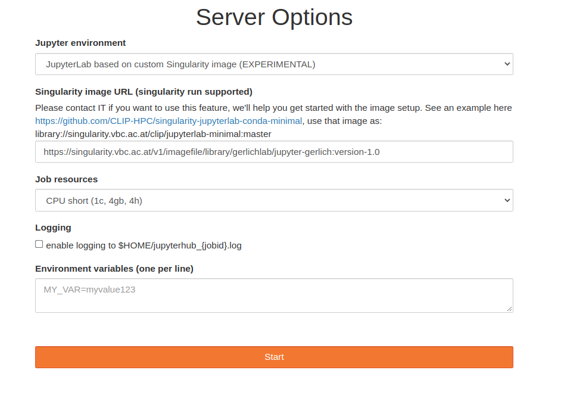
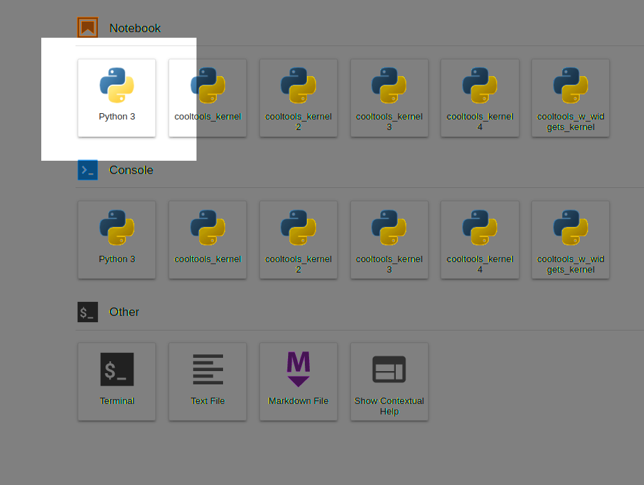

# Gerlich Jupyter
**Gerlich Jupyter** is our base container with all internally used NGS and image analysis tools preinstalled.

# VBC JupyterHub

You can run use this container on ```https://jupyterhub.vbc.ac.at/```.
To set it up, use the following settings.
 - Select `JupyterLab based on custom Singularity image (EXPERIMENTAL)`
 - Type in the link to the image location, you can find a link in the version section below.
 - **Attention:** You do not need to contact IT. We set everything up for you!





You change the version by changing the image URL past the double colon:
`.../gerlichlab/jupyter-gerlich:YOUR_FAVORITE_VERSION`

or <span style="color:red">**copy and past the link from the version subsection bellow.**<span>
 
**Please for now use the chached location!**

Once the server is started, do not choose a specific kernel. Rather, choose the basic Python3 kernel.





It will contain everything installed in the container.

# Running the notebook locally (OPTIONAL)
For your convenience, you can then start a notebook server with all the necessary libraries installed with:
```docker-compose up``` from the command line in the directory of this rpository.
Then open up a browser and navigate to http://localhost:9999 or http://localhost:9999/lab for the jupyter lab interface. 
This will prompt you for a password, which we disclosed in the python club lecture.

If you use this setup more regularly, please change the password in the jupyter_notebook_config.py

# Connecting the local notebook to VSCode 
A brief description by Michael can be found [here](https://github.com/gerlichlab/python_club_seq_formats_I).

# Versions

## Verion 1.4
- Version that supports to read ROI files .zip or .roi generated with ImageJ

Chached Location:
 
 `/groups/gerlich/labinfo/singularity_images/jupyter-gerlich:version-1.4` 
 
Singularity image URL: 

`https://singularity.vbc.ac.at/v1/imagefile/library/gerlichlab/jupyter-gerlich:version-1.4`

## Verion 1.3

- Fixed bug in ngs package

Chached Location:
 
 `/groups/gerlich/labinfo/singularity_images/jupyter-gerlich:version-1.3` 
 
Singularity image URL: 
 
`https://singularity.vbc.ac.at/v1/imagefile/library/gerlichlab/jupyter-gerlich:version-1.3`


## Verion 1.2

- Version with sparse package installed for dask access of coolers

Chached Location:
 
 `/groups/gerlich/labinfo/singularity_images/jupyter-gerlich:version-1.2` 
 
Singularity image URL:
 
`https://singularity.vbc.ac.at/v1/imagefile/library/gerlichlab/jupyter-gerlich:version-1.2`

## Verion 1.1
 
- Version with singularity terminal support

Chached Location:
 
 `/groups/gerlich/labinfo/singularity_images/jupyter-gerlich:version-1.1` 
 
Singularity image URL:
 
`https://singularity.vbc.ac.at/v1/imagefile/library/gerlichlab/jupyter-gerlich:version-1.1`

## Version 1.0
- Base version

Chached Location:
 
 `/groups/gerlich/labinfo/singularity_images/jupyter-gerlich:version-1.0` 
 
Singularity image URL:

 `https://singularity.vbc.ac.at/v1/imagefile/library/gerlichlab/jupyter-gerlich:version-1.0`

# How do I get a custom version
 
- Fork the repository
- Create a new branch
- Modify the gerlich_base.yml (e.g., add all your missing libraries or change the version of the libraries)
- Test your build by running: `docker-compose -f docker-dev.yml up`
- Test your notebook in the browser: http://localhost:9999
- Pushing your branch will create a pull request. Add a description for your version, including what is different from the base version and why it was created. The description can be extended and modified on the GitHub homepage.
- Contact Christoph or Michael. We will give it a new version number and make it available on jupyterhub.vbc.ac.at
