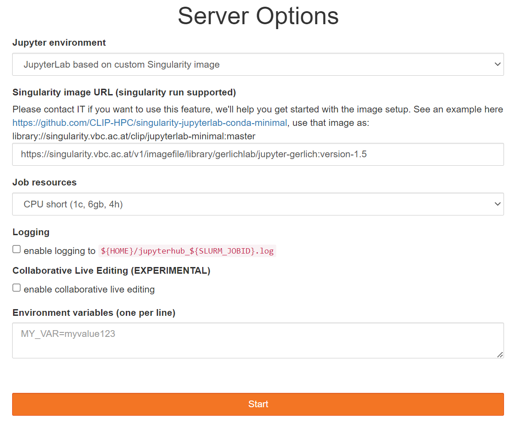

# Gerlich Jupyter
**Gerlich Jupyter** This is the Gerlich group base container for [JupyterHub](https://jupyterhub.vbc.ac.at/), with all internally used NGS and image analysis tools preinstalled.

# Startup on VBC JupyterHub

You can use this container on [JupyterHub](https://jupyterhub.vbc.ac.at/).
To set it up, use the following settings:
 - After authenticating on JupyterHub and clicking "Add New Server" on the hub homepage, select `JupyterLab based on custom Singularity image (EXPERIMENTAL)`
 - Type in the link to the image location. You can find a link in the [changelog](./changelog.md).
 - **Attention:** You do not need to contact IT. We set everything up for you!



You can change the version by modifying the version identifier, which is the part of the image URL after the colon:
`.../gerlichlab/jupyter-gerlich:YOUR_FAVORITE_VERSION`

or <span style="color:red">**copy and paste the link from the version subsection below.**<span>
 
**Please, for now, use the cached location!**

Once the server is started, do not choose a specific kernel. Instead, choose the basic Python3 kernel.


It will contain everything installed in the container.

# Running the notebook locally (OPTIONAL)
For your convenience, you can start a notebook server with all the necessary libraries installed by running:
`docker-compose up` from the command line in the directory of this repository.
Then open a browser and navigate to http://localhost:9999 or http://localhost:9999/lab for the JupyterLab interface. 
This will prompt you for a password, which we disclosed in the Python Club lecture.

If you use this setup more regularly, please change the password in the `jupyter_notebook_config.py`. 
To do this, modify the following line in the configuration file:

```python
# The string should be of the form type:salt:hashed-password.
c.NotebookApp.password = u'sha1:d1ed07fdae18:5423fffeca03b4b1c1d96f79317abe816a220a69'
```

To create a new hashed password, you can use the following Python code:

```python
from notebook.auth import passwd
print(passwd())
```

This will prompt you to enter a new password and generate a hashed password string. Replace the existing value of `c.NotebookApp.password` with the new hashed password string.

# Connecting the local notebook to VSCode 
A brief description by Michael can be found [here](https://github.com/gerlichlab/python_club_seq_formats_I).

# How do I get a custom version?
 
1. Fork the repository.
1. Create a new branch.
1. Modify the [gerlich_base.yml](./gerlich_base.yml) (e.g., add all your missing libraries or change the version of the libraries).
1. Test your build by running: `docker-compose -f docker-dev.yml up`.
1. Test your notebook in the browser: `http://localhost:9999`.
1. Pushing your branch will create a pull request. Add a description for your version, including what is different from the base version and why it was created. The description can be extended and modified on the GitHub homepage.
1. Contact Christoph or Michael. We will give it a new version number and make it available on JupyterHub at `jupyterhub.vbc.ac.at`.
